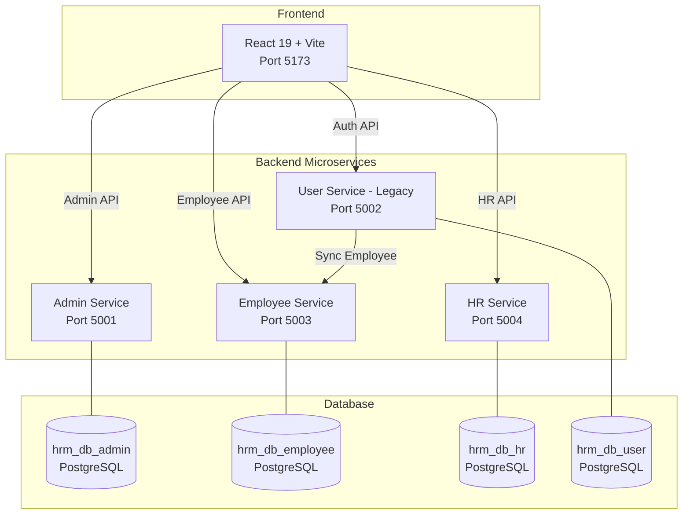

# HRM — Human Resource Management System

A microservices-based HRM application built with **Spring Boot 3.4** (Java 17) and **React 19** (Vite).

---

## Architecture



## Tech Stack

| Layer      | Technology                                    |
|------------|-----------------------------------------------|
| Frontend   | React 19, Vite, Tailwind CSS, React Router 7  |
| Backend    | Spring Boot 3.4, Spring Security, Spring Data JPA |
| Database   | PostgreSQL                                    |
| Auth       | JWT (jjwt 0.11.5)                            |
| Build      | Gradle (Backend), npm (Frontend)              |
| Java       | 17                                            |

## Features

- **Employee Self-Service**: Profile management, attendance (manual + GPS), leave applications
- **HR Management**: Employee CRUD, attendance oversight, leave approvals, department management
- **Admin Panel**: Company management, system users, dashboard statistics
- **Authentication**: JWT-based stateless auth with role-based access control (ADMIN, HR_MANAGER, EMPLOYEE)
- **Audit Logging**: All actions are logged for compliance
- **Notifications**: System notifications for leave approvals/rejections

## Prerequisites

- **Java 17+** (JDK)
- **PostgreSQL 14+**
- **Node.js 18+** and npm
- **Git**

## Quick Start

### 1. Clone & Configure

```bash
git clone <repository-url>
cd HRM

# Copy environment template and fill in your values
cp hrm_backend/.env.example hrm_backend/.env
cp hrm_frontend/.env.example hrm_frontend/.env
```

### 2. Setup Database

```sql
-- Create databases in PostgreSQL
CREATE DATABASE hrm_db_admin;
CREATE DATABASE hrm_db_employee;
CREATE DATABASE hrm_db_hr;
CREATE DATABASE hrm_db_user;
```

### 3. Start Backend Services

```bash
# Admin Service (Port 5001)
cd hrm_backend/Admin_Backend
./gradlew bootRun

# Employee Service (Port 5003) — in another terminal
cd hrm_backend/Employee_Backend
./gradlew bootRun

# HR Service (Port 5004) — in another terminal
cd hrm_backend/HR_Backend
./gradlew bootRun

# User Service (Port 5002) — in another terminal
cd hrm_backend/User_Backend
./gradlew bootRun
```

### 4. Start Frontend

```bash
cd hrm_frontend
npm install
npm run dev
# App runs at http://localhost:5173
```

## Project Structure

```
HRM/
├── hrm_backend/
│   ├── .env                    # Environment variables (git-ignored)
│   ├── .env.example            # Template for env vars
│   ├── Admin_Backend/          # Admin management service
│   │   └── src/main/java/com/affin/hrm/
│   │       ├── config/         # Security, JWT, ModelMapper config
│   │       ├── controller/     # REST API controllers
│   │       ├── dto/            # Data Transfer Objects
│   │       ├── exception/      # Custom exceptions + global handler
│   │       ├── model/          # JPA entities
│   │       ├── repository/     # Spring Data JPA repositories
│   │       └── service/        # Business logic services
│   ├── Employee_Backend/       # Employee self-service
│   │   └── src/main/java/com/affin/hrm/
│   │       ├── config/         # Security, JWT, ModelMapper config
│   │       ├── controller/     # REST API controllers
│   │       ├── dto/            # Data Transfer Objects
│   │       ├── exception/      # Custom exceptions + global handler
│   │       ├── model/          # JPA entities
│   │       ├── repository/     # Spring Data JPA repositories
│   │       └── service/        # Business logic services
│   ├── HR_Backend/             # HR management service
│   └── User_Backend/           # Legacy auth service
├── hrm_frontend/
│   ├── .env                    # Frontend env vars
│   └── src/
│       ├── Pages/              # Route pages (employee/, hr/, admin/)
│       ├── components/         # Shared components
│       └── services/api.js     # Centralized API client
├── scripts/
│   ├── sql/                    # Database scripts
│   └── powershell/             # Utility scripts
└── docs/                       # Documentation
```

## Environment Variables

See [`.env.example`](hrm_backend/.env.example) for a full list. Key variables:

| Variable                 | Description                    | Default           |
|--------------------------|--------------------------------|--------------------|
| `DB_HOST`                | PostgreSQL host                | `localhost`        |
| `DB_PORT`                | PostgreSQL port                | `5432`             |
| `EMPLOYEE_DB_PASSWORD`   | Employee DB password           | —                  |
| `JWT_SECRET`             | JWT signing secret (min 256b)  | —                  |
| `CORS_ALLOWED_ORIGINS`   | Allowed CORS origins           | `http://localhost:5173` |

## API Documentation

See [docs/API.md](docs/API.md) for the complete API reference.

## License

Proprietary — Affin HRM
