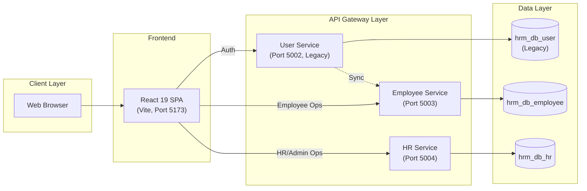
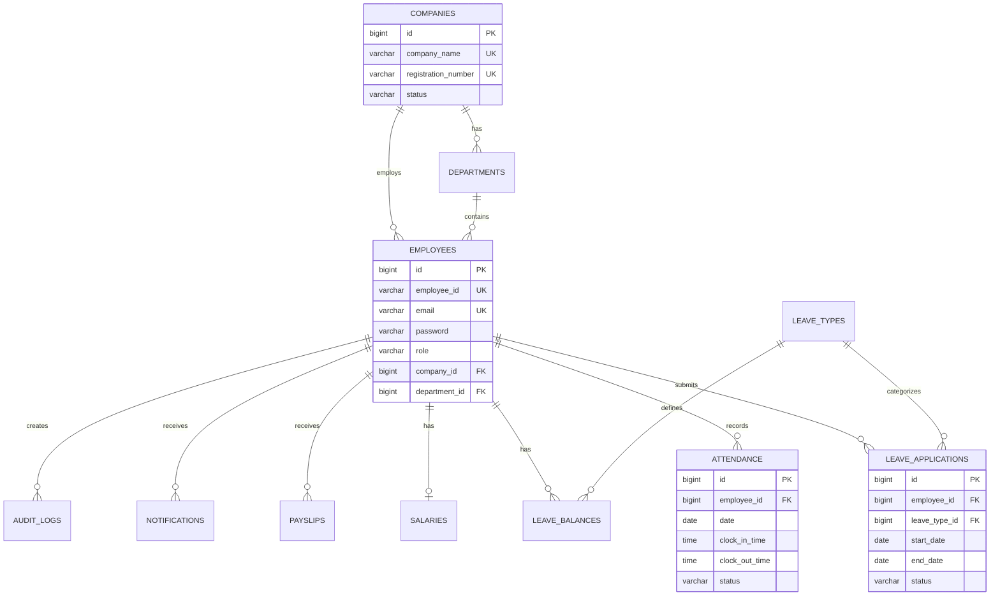
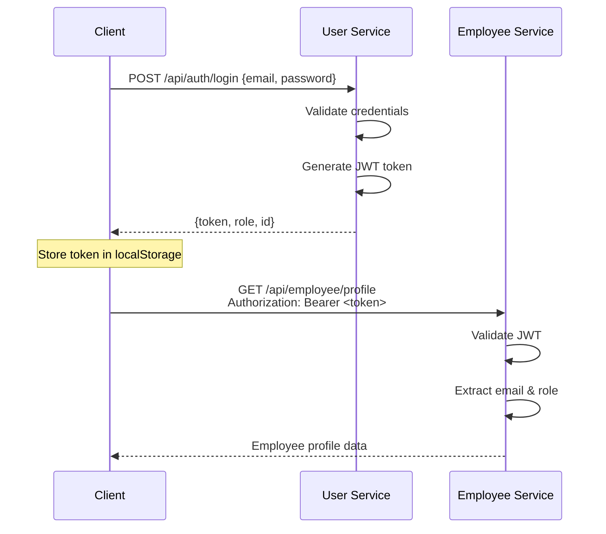

# HRM — Architecture Guide

## Service Architecture

The HRM system follows a **microservices architecture** with three backend services and a React frontend:

## Service Responsibilities

### Employee Service (Port 5003)
The **primary service** handling:
- Employee self-service (profile, attendance, leave)
- Authentication & JWT token generation
- Attendance clock-in/out (manual + GPS)
- Leave application & cancellation
- Sync endpoint for receiving data from User Service

### HR Service (Port 5004)
Handles HR manager and admin operations:
- Employee CRUD (create, update, deactivate, terminate)
- Attendance oversight & adjustment approvals
- Leave approvals & rejections
- Company management (admin)
- Dashboard statistics
- Audit logging

### User Service (Port 5002) — Legacy
> ⚠️ **Deprecated** — This service handles initial registration and syncs data to the Employee Service.

## Database Schema

## Authentication Flow

## Security

- **JWT tokens** contain email, role, and expiration
- **BCrypt** password hashing
- **Role-based access control** (RBAC): ADMIN > HR_MANAGER > EMPLOYEE
- **CORS** configured per environment (no wildcards in production)
- **Stateless sessions** — no server-side session storage

## Key Design Decisions

1. **Package naming**: `com.affin.hrm.{config,controller,dto,model,repository,service,exception}` (lowercase, Java convention)
2. **Constructor injection** throughout — no `@Autowired` field injection
3. **Global exception handler** (`@RestControllerAdvice`) — controllers never use try-catch
4. **SLF4J logging** — no `System.out.println`
5. **`@Transactional(readOnly = true)`** on read operations for performance
6. **`@JsonIgnore`** on bidirectional relationships to prevent infinite recursion
7. **`@ToString.Exclude`** on lazy-loaded fields to prevent `LazyInitializationException`
