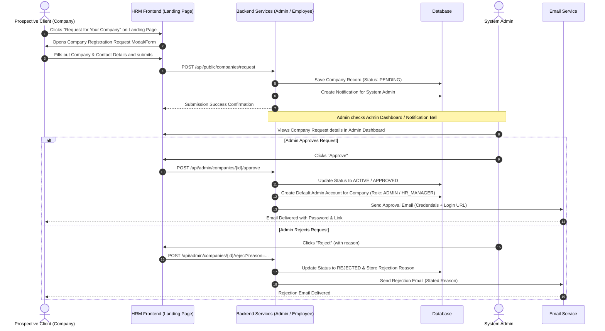

# Company Registration Request Feature Specification

## Overview

The **Company Registration Request** feature enables potential client companies to submit an application directly from the public HRM landing page (Hero section). Upon submission, system administrators receive a real-time notification, view the submitted details in the Admin Dashboard, and can either **Approve** or **Reject** the application.

- **On Approval**: The system marks the company status as `ACTIVE` (or `APPROVED`), auto-generates a Company Admin user account, and sends an automated welcome email containing temporary credentials and a direct portal login link.
- **On Rejection**: The system updates the status to `REJECTED` and sends an email to the client stating the rejection reason.

---

## 1. Functional Requirements & Workflow



---

## 2. Form Fields Specification

The "Request for Your Company" form captures necessary details to establish the company profile and provision the first administrator account.

| Section | Field Name | Key / DTO Property | Type | Required | Description |
| :--- | :--- | :--- | :--- | :--- | :--- |
| **Company Information** | Company Name | `companyName` | String | Yes | Unique name of the organization |
| | Business Reg. Number | `registrationNumber` | String | Yes | Official tax/registration ID |
| | Business Email | `email` | String (Email) | Yes | Primary email for correspondence & login |
| | Phone Number | `phone` | String | Yes | Contact phone number |
| | Office Address | `address` | String | Yes | Physical or postal address |
| | Website URL | `website` | String | No | Official company website |
| | Industry / Sector | `industry` | String | Yes | e.g. IT, Healthcare, Retail, Finance |
| | Estimated Employees | `employeeCount` | Integer | Yes | Total workforce count |
| **Contact Person** | Full Name | `contactPersonName` | String | Yes | Person requesting the service |
| | Designation | `contactPersonRole` | String | No | e.g. CEO, HR Director |
| | Additional Notes | `notes` | String | No | Optional message to Admin |

---

## 3. Database Schema & Models

### `companies` Table Schema Updates

```sql
ALTER TABLE companies
    ADD COLUMN IF NOT EXISTS industry VARCHAR(100),
    ADD COLUMN IF NOT EXISTS contact_person_name VARCHAR(100),
    ADD COLUMN IF NOT EXISTS contact_person_role VARCHAR(100),
    ADD COLUMN IF NOT EXISTS notes TEXT;
```

### Entity Fields (`Company.java`)
- `id` (Long, PK)
- `companyName` (String, Unique, Not Null)
- `registrationNumber` (String, Unique, Not Null)
- `email` (String, Not Null)
- `phone` (String, Not Null)
- `address` (String)
- `website` (String)
- `industry` (String)
- `contactPersonName` (String)
- `contactPersonRole` (String)
- `notes` (String)
- `status` (Enum: `PENDING`, `APPROVED`, `ACTIVE`, `REJECTED`, `SUSPENDED`)
- `rejectionReason` (String)
- `createdAt` (LocalDateTime)
- `updatedAt` (LocalDateTime)

---

## 4. API Specification

### 1. Public Endpoint: Submit Company Request
- **URL**: `POST /api/public/companies/request`
- **Access**: Public (Unauthenticated)
- **Request Body**:
  ```json
  {
    "companyName": "Acme Corp",
    "registrationNumber": "REG-998877",
    "email": "contact@acmecorp.com",
    "phone": "+1 555 0199",
    "address": "100 Innovation Way, Suite 400",
    "website": "https://acmecorp.com",
    "industry": "Software & Technology",
    "employeeCount": 150,
    "contactPersonName": "John Doe",
    "contactPersonRole": "Head of Operations",
    "notes": "Looking forward to using HRM for our growing team."
  }
  ```
- **Response** (`201 Created`):
  ```json
  {
    "success": true,
    "message": "Your company request has been submitted successfully. Our team will review your application and send credentials to your email upon approval.",
    "data": {
      "id": 12,
      "companyName": "Acme Corp",
      "status": "PENDING"
    }
  }
  ```

### 2. Admin Endpoint: List Company Requests
- **URL**: `GET /api/admin/companies?status=PENDING`
- **Access**: Admin (`hasRole('ADMIN')`)
- **Response** (`200 OK`): List of company request DTOs.

### 3. Admin Endpoint: Approve Request
- **URL**: `POST /api/admin/companies/{id}/approve`
- **Access**: Admin (`hasRole('ADMIN')`)
- **Process**:
  1. Updates `company.status` to `ACTIVE` in database.
  2. Provisions the initial **HR Manager Account** in `employees` table:
     - `email`: `contact@acmecorp.com` (Client Email)
     - `fullName`: `contactPersonName` (e.g., John Doe)
     - `password`: BCrypt-hashed auto-generated temporary password (e.g. `Acme#2026!HR`)
     - `role`: `HR_MANAGER`
     - `company_id`: `{id}`
     - `companyName`: `companyName`
     - `status`: `ACTIVE`
  3. **User Database (`hrm_db_user`) Synchronization**:
     - Automatically syncs the approved Company record and HR account to `User_Backend` (`hrm_db_user`) attached with `companyId` and `companyName`.
     - Ensures every newly created account under this company is updated with the company name and identifier in `hrm_db_user`.
  4. Sends Welcome Email to `contact@acmecorp.com` with:
     - **HR Account Credentials** (email + plain temporary password)
     - Direct Login Portal URL (`http://localhost:5173/login`)
- **Response** (`200 OK`): Updated CompanyDTO with `status: "ACTIVE"`.

### 4. Admin Endpoint: Reject Request
- **URL**: `POST /api/admin/companies/{id}/reject?reason={reason}`
- **Access**: Admin (`hasRole('ADMIN')`)
- **Process**:
  1. Updates `company.status` to `REJECTED` and sets `rejectionReason`.
  2. Sends Rejection Email to client with stated reason.
- **Response** (`200 OK`): Updated CompanyDTO with `status: "REJECTED"`.

---

## 5. Email Templates

### A. Approval Email (HR Manager Credentials Included)
- **Subject**: Welcome to HRM — Company Approved & HR Account Created 🎉
- **Body**:
  > Dear **{contactPersonName}**,
  >
  > We are pleased to inform you that your application for **{companyName}** has been **APPROVED**!
  >
  > Your **HR Manager Account** has been provisioned. You can now access your company HR portal using the credentials below:
  >
  > - **Portal Login URL**: [http://localhost:5173/login](http://localhost:5173/login)
  > - **HR Account Email**: `{email}`
  > - **Temporary Password**: `{temporaryPassword}`
  > - **Account Role**: HR Manager (`HR_MANAGER`)
  >
  > *For security reasons, please log in and change your password immediately upon your first sign-in.*
  >
  > Best regards,  
  > **HRM System Administration Team**

### B. Rejection Email
- **Subject**: HRM Company Request Status — {companyName}
- **Body**:
  > Dear **{contactPersonName}**,
  >
  > Thank you for your interest in our HRM platform. After reviewing your application for **{companyName}**, we regret to inform you that we are unable to approve your request at this time.
  >
  > **Reason for Rejection**: {rejectionReason}
  >
  > If you believe this is an error or have further details to provide, please contact our support team.
  >
  > Best regards,  
  > **HRM System Administration Team**

---

## 6. Frontend UI Components

1. **Hero Section (`hero.jsx`)**:
   - Add prominent CTA button: `"Request for Your Company"` on the left side of the Hero action bar.
   - Clicking opens the `CompanyRequestModal`.

2. **Public Company Request Modal (`CompanyRequestModal.jsx`)**:
   - Modern glassmorphism/gradient dialog with multi-step or clean 2-column layout.
   - Live validation, loading state, and success overlay.

3. **Admin Dashboard / Company Page (`Companies.jsx`)**:
   - Connect live data from `GET /api/admin/companies`.
   - Real-time status tabs (`All`, `Pending`, `Active`, `Rejected`).
   - Detailed modal showing full application data with `Approve` and `Reject (with Reason)` triggers.
   - In-app Admin notification alert when new company requests arrive.
