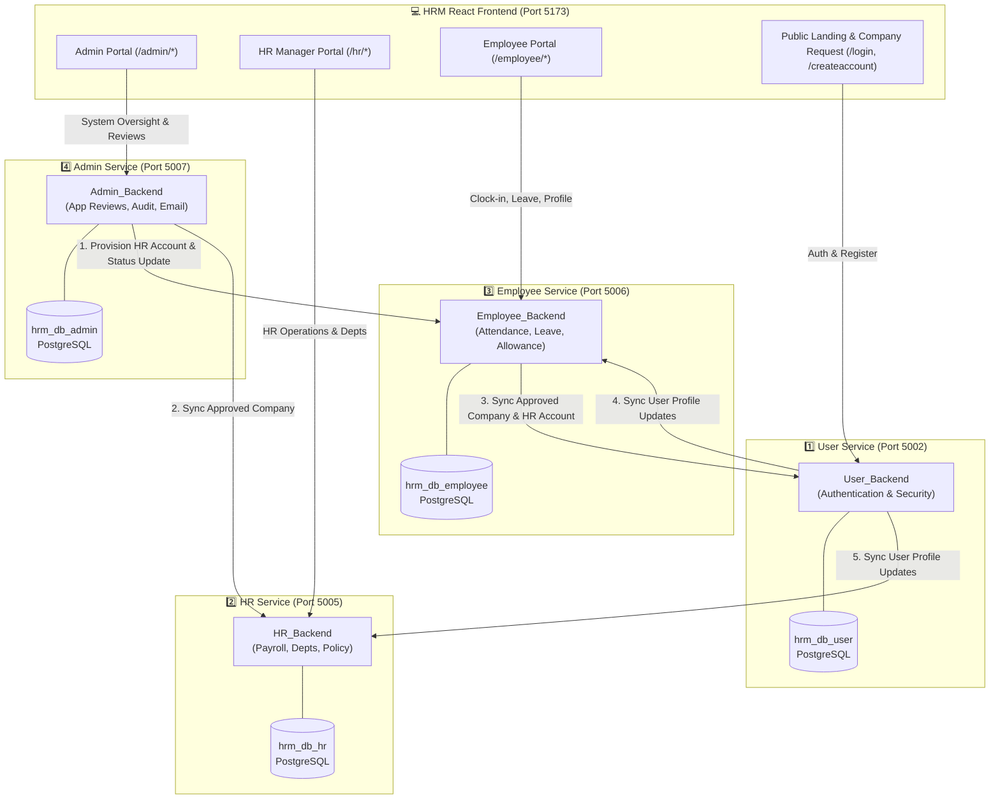
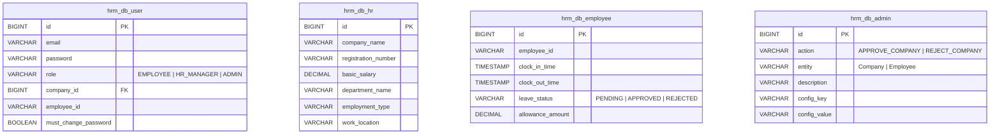

# 🌐 HRM Microservices Architecture & Database Interconnection Guide

This document provides a high-level overview of the **4 Microservices Architecture** in the HRM System, showing how each database (`hrm_db_user`, `hrm_db_hr`, `hrm_db_employee`, `hrm_db_admin`) operates, its owned entities/tables, and how data is synchronized across services.

---

## 🏛️ System Overview Diagram

---

## 💾 Detailed Database Schemas & Owned Tables

---

## 🔄 Core Data Flow Scenarios

### 1️⃣ Company Registration & Admin Approval Flow
1. **Public Submission**: Client submits company request via Frontend -> Saved in `Employee_Backend` / `User_Backend` as `PENDING`.
2. **Admin Review**: System Administrator approves/rejects application via `Admin_Backend` (Port 5007).
3. **Auto-Provisioning**: `Admin_Backend` invokes `Employee_Backend` to set company status to `APPROVED` and provision an `HR_MANAGER` account with `mustChangePassword = true`.
4. **Automated Notification**: `Admin_Backend`'s `EmailService` sends an approval welcome email (or rejection email with stated reasons) to the client.
5. **Database Sync**:
   - `Admin_Backend` syncs company data to `HR_Backend` (`hrm_db_hr`).
   - `Employee_Backend` syncs company & HR Manager details to `User_Backend` (`hrm_db_user`).
   - `Admin_Backend` writes audit log record (`APPROVE_COMPANY`) into `hrm_db_admin`.

---

### 2️⃣ Employee Account Creation & Access Flow
1. **HR Creation**: HR Manager adds an employee via HR Portal.
2. **User Database Creation**: Saved into `hrm_db_user` under HR Manager's company ID.
3. **Multi-Service Propagation**: `User_Backend`'s `SyncService` propagates employee record to `hrm_db_employee` (for attendance/leave) and `hrm_db_hr` (for payroll/salaries).
4. **Login Verification**: Employee logs in via `User_Backend` JWT endpoint; authentication checks `hrm_db_user`.

---

## 📊 Quick Service Reference Matrix

| Microservice | Port | Database Name | Primary Responsibilities | Key Tables |
| :--- | :--- | :--- | :--- | :--- |
| **`User_Backend`** | `5002` | `hrm_db_user` | JWT Authentication, Security, Passwords, User Directory | `employees`, `users`, `companies`, `departments`, `session_logs` |
| **`HR_Backend`** | `5005` | `hrm_db_hr` | Payroll Policy, Department Management, Salary Structures | `companies`, `departments`, `basic_payments`, `leave_allocations` |
| **`Employee_Backend`**| `5006` | `hrm_db_employee` | Daily Operations, Attendance Clocking, Leave Requests, Allowances | `employees`, `attendance`, `leave_applications`, `allowance_requests` |
| **`Admin_Backend`** | `5007` | `hrm_db_admin` | System Administration, Application Approval/Rejection, Emailing, Audit Logs | `audit_logs`, `system_configurations` |
