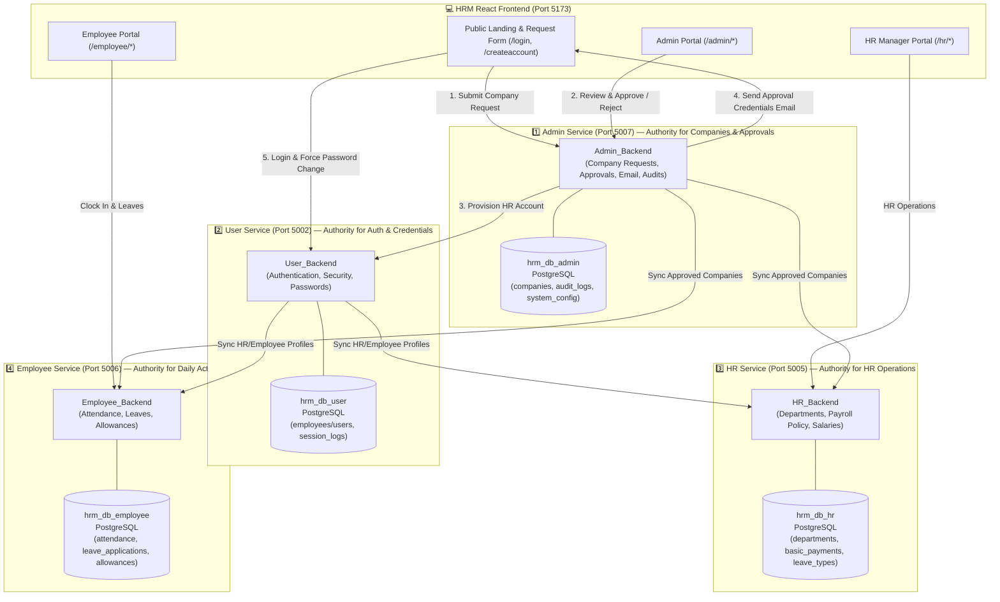
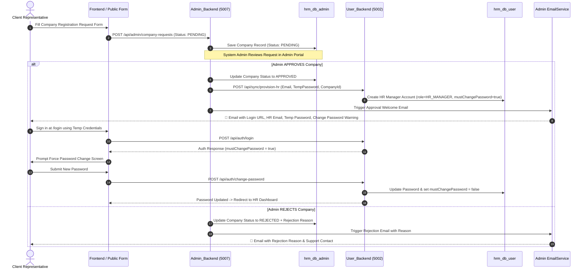

# 🌐 HRM System Architecture & Company Approval Process Guide

This document outlines the **4 Microservices Architecture** for the HRM platform, specifying database ownership, the complete company registration review workflow, HR Manager account provisioning, automated email notifications, and forced password change security.

---

## 🏛️ System Overview & Microservice Responsibilities

---

## 🔄 Sequence Diagram: Company Application to HR Login

---

## 💾 Database Ownership & Table Schema Matrix

| Database Name | Owning Microservice | Tables Managed | Description & Primary Use Case |
| :--- | :--- | :--- | :--- |
| **`hrm_db_admin`** | **`Admin_Backend`** (Port 5007) | `companies` `audit_logs` `system_configurations` | **Authority for Client Companies**: Stores all company registration requests (PENDING, APPROVED, REJECTED), rejection reasons, system audit logs, and configuration parameters. |
| **`hrm_db_user`** | **`User_Backend`** (Port 5002) | `employees` / `users` `session_logs` | **Authority for Credentials & Auth**: Manages user accounts (`EMPLOYEE`, `HR_MANAGER`, `ADMIN`), hashed BCrypt passwords, `must_change_password` flag, and active login sessions. |
| **`hrm_db_hr`** | **`HR_Backend`** (Port 5005) | `departments` `basic_payments` `additional_payments` `leave_types` `work_locations` | **Authority for HR Operations**: Manages company departments, job role pay structures, leave allocations, work locations, and employment types. |
| **`hrm_db_employee`** | **`Employee_Backend`** (Port 5006) | `attendance` `leave_applications` `allowance_requests` `notifications` | **Authority for Daily Activities**: Stores employee clock-in/out timestamps, leave requests, allowance submissions, and employee notifications. |

---

## 📋 Implementation Checklist for Restructuring

Below is the structured task breakdown to be executed upon finalization:

1. **`Admin_Backend` (`hrm_db_admin`)**:
   - Move/Ensure `Company` entity and repository exist inside `Admin_Backend`.
   - Store all public registration submissions directly into `hrm_db_admin.companies` as `PENDING`.
   - Handle Admin Dashboard company tabs: **Pending Applications**, **Approved Companies**, **Rejected Applications** (with reasons), and **Company Members**.

2. **`User_Backend` (`hrm_db_user`)**:
   - Implement `/api/sync/provision-hr` endpoint to receive HR Manager account provisioning details from `Admin_Backend`.
   - Save HR Manager user with `mustChangePassword = true`.
   - Maintain `changePassword` endpoint to clear `mustChangePassword = false` upon first password update.

3. **Email Delivery (`Admin_Backend`)**:
   - `EmailService` in `Admin_Backend` formats and sends approval welcome email containing login link, HR email, generated temporary password, and force password change instructions.

4. **Inter-Service Sync**:
   - Sync approved company details from `Admin_Backend` to `HR_Backend` (`hrm_db_hr`) and `Employee_Backend` (`hrm_db_employee`).
