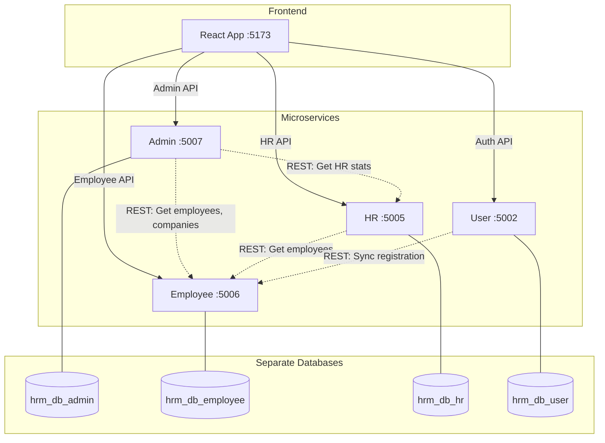

# Inter-Service Communication — Implementation Plan

## Goal
Each microservice keeps its **own separate database**, but services communicate via **REST API calls** to share data.

## Architecture



## What Each Service Owns (in its DB)

| Service | Database | Own Tables |
|---------|----------|-----------|
| **Admin** (5007) | `hrm_db_admin` | `audit_logs`, `system_configuration` |
| **Employee** (5006) | `hrm_db_employee` | `employees`, `companies`, `departments`, `attendance`, `leave_*`, `notifications`, `salaries`, `payslips` |
| **HR** (5005) | `hrm_db_hr` | `hr_audit_logs` (HR-specific audit only) |
| **User** (5002) | `hrm_db_user` | `users` (legacy registration) |

## Inter-Service Calls Needed

### Admin_Backend → Employee_Backend
- `GET /api/admin/stats` → calls Employee_Backend for employee count, attendance stats
- `GET /api/admin/companies` → calls Employee_Backend `/api/internal/companies`
- `GET /api/admin/users` → calls Employee_Backend `/api/internal/employees`
- `PUT /api/admin/users/{id}/role` → calls Employee_Backend `/api/internal/employees/{id}/role`

### HR_Backend → Employee_Backend
- HR employee management → calls Employee_Backend internal APIs
- Attendance/Leave management → calls Employee_Backend internal APIs

### User_Backend → Employee_Backend
- Already exists: `POST /api/sync/employee` (sync on registration) ✅

## Proposed Changes

### 1. Employee_Backend — Add Internal API endpoints
New controller: `InternalController.java` (no JWT required, service-to-service only)

```
GET    /api/internal/employees           → List all employees
GET    /api/internal/employees/{id}      → Get employee by ID
PUT    /api/internal/employees/{id}/role → Update role
GET    /api/internal/companies           → List all companies
POST   /api/internal/companies           → Create company
PUT    /api/internal/companies/{id}      → Update company
GET    /api/internal/stats               → Dashboard stats (counts)
GET    /api/internal/attendance/daily    → Daily attendance
GET    /api/internal/leave/pending       → Pending leaves
```

### 2. Admin_Backend — Use RestTemplate instead of direct DB
- Remove Employee/Company/Department models and repositories (keep only AuditLog, SystemConfiguration)
- Add `RestTemplateConfig.java` with service URLs from `.env`
- Refactor `AdminService.java` to call Employee_Backend via RestTemplate

### 3. HR_Backend — Use RestTemplate for employee data
- Remove duplicate Employee/Company models
- Add `RestTemplateConfig.java`
- Refactor services to call Employee_Backend via RestTemplate

### 4. .env — Add service URLs
```
EMPLOYEE_SERVICE_URL=http://localhost:5006
HR_SERVICE_URL=http://localhost:5005
ADMIN_SERVICE_URL=http://localhost:5007
```

## Registration Flow (After Implementation)

```
1. User registers on frontend
2. Frontend calls → User_Backend POST /api/auth/register
3. User_Backend saves to hrm_db_user
4. User_Backend calls → Employee_Backend POST /api/sync/employee
5. Employee_Backend saves to hrm_db_employee
6. Admin opens dashboard
7. Frontend calls → Admin_Backend GET /api/admin/stats
8. Admin_Backend calls → Employee_Backend GET /api/internal/stats
9. Employee_Backend returns data from hrm_db_employee
10. Admin sees the registered user ✅
```

## Open Questions

> [!IMPORTANT]
> **Security for internal APIs**: Should the internal endpoints (`/api/internal/*`) be:
> - Open (no auth) — simpler, but less secure
> - Protected with a shared API key — recommended for production
>
> For development, I'll start with open (no auth) and add API key protection later.

## Verification
- Build all 4 services
- Start all services
- Register a user → verify Admin can see them via dashboard
